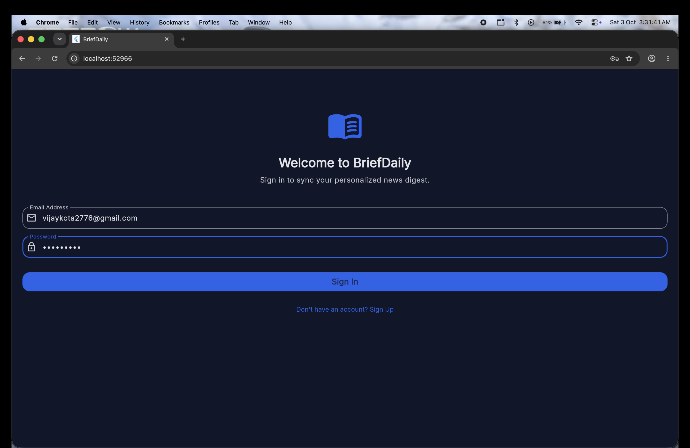
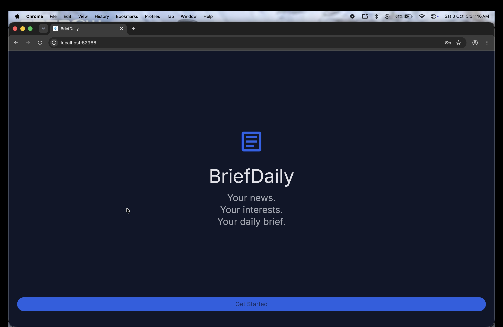
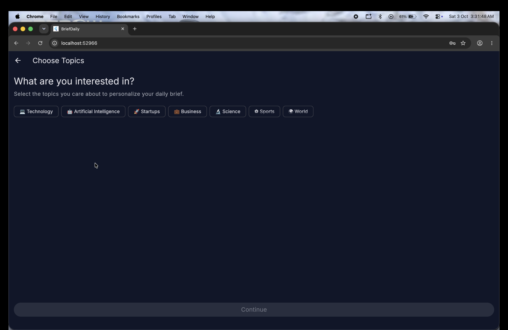
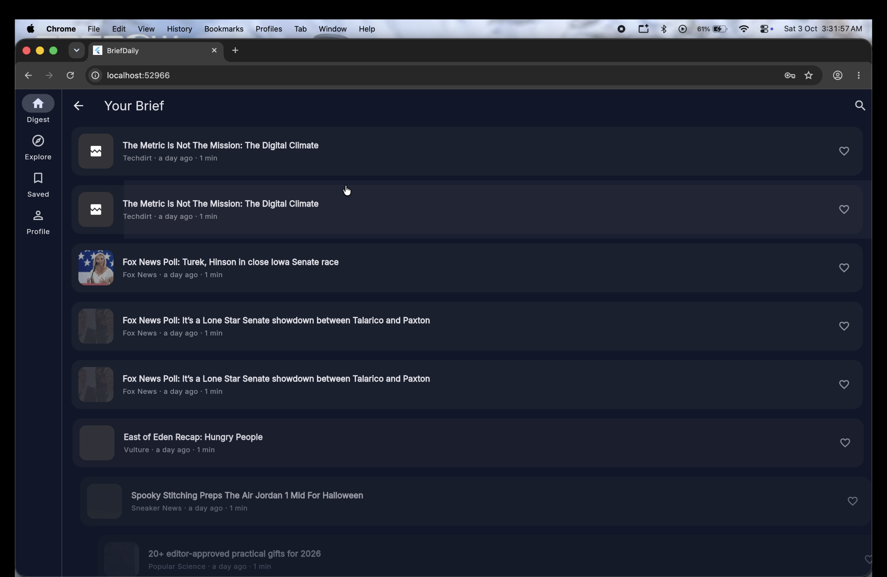
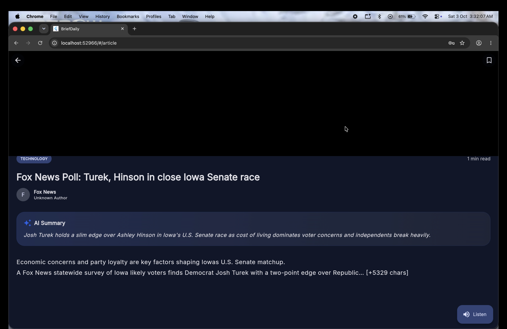
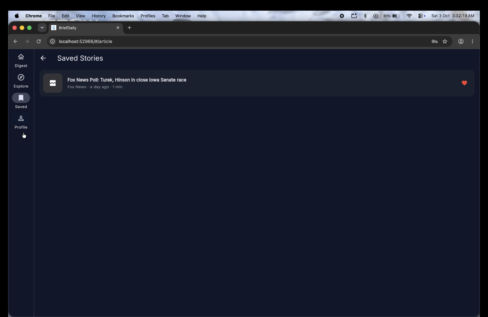

# BriefDaily

## Personalized News Digest & Bookmark App

BriefDaily is a personalized news digest and bookmarking application built with **Flutter and Dart**. The application allows users to select topics of interest, browse a personalized collection of current news articles, read articles, and save stories for later.

The project combines **Flutter Material 3**, **Riverpod state management**, **Firebase Authentication**, **NewsAPI**, **Hive local persistence**, responsive layouts, and an editorial-style user interface designed in Figma.

---

## 📸 Screenshots & Demo

Here is a look at the final application in action!

<div style="display: flex; flex-wrap: wrap; gap: 10px;">
  
  
  
  
  
  
</div>

### 🎥 Demo Video & Documentation
- [Watch the Demo Video](docs/demo_video.mov)
- [View the Project Documentation (PDF)](docs/Briefdaily.pdf)

---

## 🔗 Project Links

### 💻 GitHub Repository

https://github.com/vijayKota2776/BriefDaily

### 🎨 Figma Design

https://www.figma.com/design/4XM721wPZWIhMLqEBanRYu

---

# 📋 Table of Contents

- [Overview](#-overview)
- [Problem Statement](#-problem-statement)
- [Objectives](#-objectives)
- [Key Features](#-key-features)
- [Application Flow](#-application-flow)
- [Screens](#-screens)
- [Technology Stack](#-technology-stack)
- [Architecture](#-architecture)
- [Project Structure](#-project-structure)
- [State Management](#-state-management)
- [News Retrieval](#-news-retrieval)
- [Authentication](#-authentication)
- [Bookmark Persistence](#-bookmark-persistence)
- [Responsive Design](#-responsive-design)
- [UI/UX Design](#-uiux-design)
- [Figma Design](#-figma-design)
- [Installation](#-installation)
- [Configuration](#-configuration)
- [Firebase Setup](#-firebase-setup)
- [NewsAPI Setup](#-newsapi-setup)
- [Running the Application](#-running-the-application)
- [Testing](#-testing)
- [Development Challenges](#-development-challenges)
- [Security Considerations](#-security-considerations)
- [Current Project Status](#-current-project-status)
- [Known Limitations](#-known-limitations)
- [Future Enhancements](#-future-enhancements)
- [Coursework Requirement Mapping](#-coursework-requirement-mapping)
- [Lessons Learned](#-lessons-learned)
- [Project Resources](#-project-resources)
- [License](#-license)

---

# 📱 Overview

BriefDaily is designed to make news consumption more focused and personalized.

Instead of presenting users with an overwhelming amount of information, the application allows users to select topics they are interested in and receive a digest centered around those preferences.

Users can:

- Create an account.
- Sign in securely.
- Select preferred news topics.
- Browse a personalized news digest.
- Read individual articles.
- View article summaries and information.
- Bookmark articles.
- Access saved articles later.
- Remove bookmarks.
- Use text-to-speech functionality.
- Manage preferences and profile information.

The project focuses on combining a clean editorial interface with practical Flutter application architecture.

---

# 🎯 Problem Statement

Modern users consume information from a large number of sources every day.

This can result in:

- Information overload.
- Difficulty discovering relevant stories.
- Repeated searches.
- Excessive scrolling.
- Difficulty saving useful articles.
- Difficulty accessing previously discovered stories.

BriefDaily addresses this by allowing users to define their interests and then presenting news based on those selected topics.

---

# 🎯 Objectives

The main objectives of BriefDaily are:

1. Provide a personalized news experience.
2. Allow users to select topics of interest.
3. Retrieve real-world news data.
4. Display current articles in a clean editorial layout.
5. Sort articles by publication time.
6. Allow users to bookmark articles.
7. Persist bookmarks locally.
8. Provide an article reading interface.
9. Provide text-to-speech functionality.
10. Support responsive layouts.
11. Use reactive state management with Riverpod.
12. Provide authentication through Firebase.
13. Create a consistent Material 3 visual system.
14. Provide a complete Figma-based UI/UX design.

---

# ✨ Key Features

## 🔐 1. Authentication

BriefDaily uses **Firebase Authentication** for user authentication.

Users can:

- Register.
- Sign in.
- Sign out.
- Access authenticated application features.

Firebase is intended to act as the authoritative authentication service.

---

## 🏷️ 2. Personalized Topic Selection

Users can select the topics that they are interested in.

Example topics include:

- Technology
- Business
- Science
- Sports
- Entertainment
- Health
- World
- Politics

Selected topics are managed using Riverpod and persisted locally.

---

## 📰 3. Personalized News Digest

The main digest screen presents current news based on selected interests.

Each article can contain:

- Headline
- Source
- Topic
- Publication time
- Article image
- Reading time
- Bookmark action

Articles are explicitly sorted using their publication timestamp so that newer articles appear first.

---

## 📖 4. Article Reading

Users can select an article and open a dedicated reading interface.

The reading experience can include:

- Article title
- Source
- Publication information
- Article content
- Summary
- Reading time
- Bookmark action
- Text-to-speech

---

## 🔖 5. Persistent Bookmarks

Users can save articles for later.

Bookmarks are stored locally using **Hive**.

Instead of storing only an article identifier, the application stores the article representation so that saved article information can remain available locally.

---

## 🗑️ 6. Bookmark Removal

Users can remove individual saved stories.

The bookmark interface supports:

- Individual deletion.
- Swipe-to-delete.
- Undo interaction.

---

## 📱 7. Responsive UI

BriefDaily supports different screen sizes.

### Mobile

The application uses a bottom navigation layout.

### Larger Screens

The application can use a NavigationRail layout.

This provides a consistent navigation experience across different screen sizes.

---

## 🎨 8. Material 3

The application uses Flutter's Material 3 design system.

The UI includes:

- Cards
- FilterChips
- NavigationBar
- NavigationRail
- Buttons
- Icons
- Text fields
- Dialogs
- Material surfaces

---

## ✍️ 9. Editorial Typography

The interface uses **Inter** as its primary typeface.

Typography hierarchy is used to distinguish:

- Page titles
- Article headlines
- Descriptions
- Metadata
- Navigation labels

---

## 🔊 10. Text-to-Speech

BriefDaily includes Flutter TTS functionality for supported article content.

This allows users to consume article information through audio.

---

# 🔄 Application Flow

The overall application flow can be represented as:

```text
                    ┌─────────────────┐
                    │   Application   │
                    │      Launch     │
                    └────────┬────────┘
                             │
                             ▼
                    ┌─────────────────┐
                    │ Authentication  │
                    │      Check      │
                    └────────┬────────┘
                             │
                  ┌──────────┴──────────┐
                  │                     │
                  ▼                     ▼
          ┌───────────────┐     ┌───────────────┐
          │ Authenticated │     │ Not Logged In │
          └───────┬───────┘     └───────┬───────┘
                  │                     │
                  │                     ▼
                  │              ┌─────────────┐
                  │              │   Login /   │
                  │              │ Registration│
                  │              └──────┬──────┘
                  │                     │
                  └──────────┬──────────┘
                             │
                             ▼
                    ┌─────────────────┐
                    │  Onboarding /   │
                    │ Topic Selection │
                    └────────┬────────┘
                             │
                             ▼
                    ┌─────────────────┐
                    │ Save Preferences│
                    └────────┬────────┘
                             │
                             ▼
                    ┌─────────────────┐
                    │  Personalized   │
                    │   News Digest   │
                    └────────┬────────┘
                             │
                  ┌──────────┴──────────┐
                  │                     │
                  ▼                     ▼
          ┌───────────────┐     ┌───────────────┐
          │  Read Article │     │   Bookmark    │
          └───────┬───────┘     └───────┬───────┘
                  │                     │
                  ▼                     ▼
          ┌───────────────┐     ┌───────────────┐
          │  Reading Mode │     │  Hive Storage │
          └───────────────┘     └───────┬───────┘
                                        │
                                        ▼
                                ┌───────────────┐
                                │ Saved Stories │
                                └───────────────┘
```

---

# 📺 Screens

The application contains the following major screens.

## Authentication
- Login
- Registration

## Onboarding
- Welcome
- Choose Topics
- Personalizing

## Main Application
- Your Brief
- Article Reading
- Saved Stories
- Profile & Settings

---

# 🛠️ Technology Stack

| Technology | Purpose |
| ---------- | ------- |
| **Flutter** | Cross-platform application framework |
| **Dart** | Programming language |
| **Riverpod** | Reactive state management |
| **Hive** | Local persistence |
| **hive_flutter** | Hive integration with Flutter |
| **Firebase Authentication** | Authentication |
| **NewsAPI** | News data |
| **HTTP** | API communication |
| **Material 3** | UI design system |
| **Google Fonts** | Typography |
| **Cached Network Image** | Image caching |
| **Flutter TTS** | Text-to-speech |
| **Figma** | UI/UX design |

---

# 🏗️ Architecture

BriefDaily follows a feature-oriented application architecture.

The conceptual architecture is:

```text
┌───────────────────────────────────────────────┐
│                   Flutter UI                  │
│               Screens + Widgets               │
└───────────────────────┬───────────────────────┘
                        │
                        ▼
┌───────────────────────────────────────────────┐
│           Riverpod State Management           │
│     Providers + Reactive Application State    │
└───────────────────────┬───────────────────────┘
                        │
                        ▼
┌───────────────────────────────────────────────┐
│            Services / Repositories            │
└──────────────┬────────────────┬───────────────┘
               │                │
               ▼                ▼
        ┌──────────────┐ ┌──────────────┐
        │   NewsAPI    │ │     Hive     │
        │     News     │ │  Local Data  │
        └──────────────┘ └──────────────┘
               │                │
               ▼                ▼
        ┌──────────────┐ ┌──────────────┐
        │   Firebase   │ │   Offline    │
        │     Auth     │ │   Storage    │
        └──────────────┘ └──────────────┘
```

---

# 🧩 Architectural Layers

## Presentation Layer
Responsible for:
- Screens
- Widgets
- Navigation
- User interactions
- Responsive layouts

## State Management Layer
Riverpod manages:
- Selected topics
- User preferences
- Digest state
- Bookmark state
- Reactive application state

## Service Layer
Services are responsible for operations such as:
- News retrieval
- External API communication
- Text-to-speech
- Data transformation

## Repository Layer
Repositories provide an abstraction between application logic and persistent data. Examples include:
- Bookmark repository
- Local preference storage

## Persistence Layer
Hive is used for local persistence. Examples include:
- Selected topics
- User preferences
- Bookmarked articles

## External Services
The application communicates with:
- Firebase Authentication
- NewsAPI

---

# 📂 Project Structure

The project follows a feature-first organization.

```text
lib/
│
├── app/
│   ├── theme/
│   └── routing/
│
├── data/
│   └── repositories/
│
├── features/
│   ├── auth/
│   │
│   ├── digest/
│   │   ├── screens/
│   │   └── widgets/
│   │
│   ├── onboarding/
│   │
│   ├── profile/
│   │
│   └── bookmarks/
│
├── models/
├── providers/
├── services/
└── main.dart
```

---

# 🔄 State Management

BriefDaily uses Riverpod for reactive application state.

The general flow is:

```text
       User Interaction
              │
              ▼
      Riverpod Provider
              │
              ▼
 Application / Service Logic
              │
              ▼
        Updated State
              │
              ▼
         UI Rebuild
```

This allows changes in user preferences and application state to propagate through the UI without manually synchronizing every screen.

---

# 📰 News Retrieval

News content is retrieved through NewsAPI.

The general data flow is:

```text
       Selected Topics
              │
              ▼
      Build API Request
              │
              ▼
           NewsAPI
              │
              ▼
        JSON Response
              │
              ▼
       Article Parsing
              │
              ▼
        Article Model
              │
              ▼
     Sort by publishedAt
              │
              ▼
          Digest UI
```

---

# 🧱 Article Model

The main Article model contains fields such as:

```text
Article
│
├── id
├── title
├── summary
├── content
├── source
├── topic
├── author
├── readingTime
├── imageUrl
├── url
└── publishedAt
```

---

# ⏱️ Newest-First Sorting

The application explicitly sorts articles by publication timestamp.

Conceptually:

```dart
articles.sort(
  (a, b) => b.publishedAt.compareTo(a.publishedAt),
);
```

This ensures that newer stories appear before older stories.

---

# 🔐 Authentication

BriefDaily uses Firebase Authentication.

The intended architecture is:

```text
┌─────────────────────┐
│ Flutter Application │
└──────────┬──────────┘
           │
           ▼
┌─────────────────────┐
│      Firebase       │
│   Authentication    │
└──────────┬──────────┘
           │
           ▼
┌─────────────────────┐
│   Authentication    │
│        State        │
└──────────┬──────────┘
           │
           ▼
┌─────────────────────┐
│     Application     │
│     Navigation      │
└─────────────────────┘
```

Firebase should remain the authoritative source for authentication state.

## 🚪 Logout

The authentication lifecycle should use Firebase sign-out:

```dart
await FirebaseAuth.instance.signOut();
```

The application can then react to the resulting Firebase authentication state. Local storage should be used for application preferences and persistence, rather than being treated as a second independent authentication system.

---

# 🔖 Bookmark Persistence

Bookmarks are stored locally using Hive.

The bookmark flow is:

```text
       Article
          │
          ▼
   Bookmark Button
          │
          ▼
  Bookmark Provider
          │
          ▼
  Article.toJson()
          │
          ▼
    JSON Encoding
          │
          ▼
        Hive
```

When the application loads saved stories:

```text
        Hive
          │
          ▼
     Stored JSON
          │
          ▼
 Article.fromJson()
          │
          ▼
  Bookmark Provider
          │
          ▼
   Saved Stories UI
```

## 💾 Why Complete Articles Are Stored

An earlier approach stored only article identifiers. That required retrieving article information again.

The improved approach stores the complete article representation. This makes saved article information available locally, even offline.

---

# 📱 Responsive Design

BriefDaily supports multiple screen sizes.

## Mobile

Mobile layouts use a bottom navigation interface.

```text
┌─────────────────────────────┐
│                             │
│        Main Content         │
│                             │
├─────────────────────────────┤
│  Brief   Saved    Profile   │
└─────────────────────────────┘
```

## Larger Screens

Larger layouts can use NavigationRail:

```text
┌──────┬──────────────────────┐
│      │                      │
│ Nav  │     Main Content     │
│ Rail │                      │
│      │                      │
└──────┴──────────────────────┘
```

---

# 🎨 UI/UX Design

The visual design follows a modern editorial news application style.

The design language includes:
- Dark visual theme.
- Blue accent color.
- Inter typography.
- Rounded cards.
- Topic chips.
- Clear headline hierarchy.
- Metadata labels.
- Consistent spacing.
- Material 3 components.

## 🎨 Color System

The primary blue accent used in the interface is: `#2563EB`

The interface uses dark surfaces with blue highlights for important interactive elements.

## ✍️ Typography

BriefDaily uses Inter as the primary typeface.

The typography hierarchy distinguishes:

```text
Large Page Title
       │
       ▼
Article Headline
       │
       ▼
Supporting Description
       │
       ▼
Source / Metadata
       │
       ▼
Navigation Labels
```

---

# 📰 Article Cards

Article cards are one of the primary reusable components. A typical card follows this structure:

```text
┌──────────────────────────────────────┐
│                                      │
│            Article Image             │
│                                      │
├──────────────────────────────────────┤
│ Technology                           │
│                                      │
│ Article headline goes here and can   │
│ occupy multiple lines.               │
│                                      │
│ Source                   2 hours ago │
│                                      │
│ 5 min read                    [Save] │
└──────────────────────────────────────┘
```

---

# 🎨 Figma Design

The BriefDaily interface was designed in Figma. The design contains both desktop and mobile screens.

## Desktop Screens
- Demo 01 — Login
- Demo 02 — Welcome
- Demo 03 — Choose Topics
- Demo 04 — Personalizing
- Demo 05 — Your Brief
- Demo 06 — Article Reading
- Demo 07 — Saved Stories
- Demo 08 — Profile & Settings

## Mobile Screens
- Mobile 01 — Login
- Mobile 02 — Welcome
- Mobile 03 — Choose Topics
- Mobile 04 — Personalizing
- Mobile 05 — Your Brief
- Mobile 06 — Article Reading
- Mobile 07 — Saved Stories
- Mobile 08 — Profile & Settings

## 🔗 Figma Resource

The editable Figma design is available here:
[https://www.figma.com/design/4XM721wPZWIhMLqEBanRYu](https://www.figma.com/design/4XM721wPZWIhMLqEBanRYu)

---

# 💻 Installation

## Prerequisites

Before running BriefDaily, install:
- Flutter SDK
- Dart SDK
- Android Studio and/or Xcode
- Git
- A configured Firebase project
- A NewsAPI API key

Check Flutter:
```bash
flutter --version
```

Check the development environment:
```bash
flutter doctor
```

## 📥 Clone the Repository

Clone the project:
```bash
git clone https://github.com/vijayKota2776/BriefDaily.git
```

Navigate to the project:
```bash
cd BriefDaily
```

## 📦 Install Dependencies

Run:
```bash
flutter pub get
```

---

# 🔥 Firebase Setup

BriefDaily uses Firebase Authentication.

### Step 1 — Create Firebase Project
Create a Firebase project through the Firebase Console.

### Step 2 — Enable Authentication
Enable the authentication providers required by the application.

### Step 3 — Connect the Flutter Application
Configure the Flutter application with the Firebase project. Depending on the platform, Firebase configuration files may include:
- `google-services.json`
- `GoogleService-Info.plist`

Follow the Firebase Flutter configuration process for the target platform.

---

# 📰 NewsAPI Setup

BriefDaily uses NewsAPI to retrieve current news articles.

Create a NewsAPI account and obtain an API key. The API key must be configured securely. Do not commit a real API key to a public GitHub repository.

## 🔑 Configuration

A production-oriented setup should keep secrets outside source control. For example:

```text
NEWS_API_KEY=<your-api-key>
```

---

# ▶️ Running the Application

After Firebase and API configuration:

```bash
flutter run
```

To see available devices:

```bash
flutter devices
```

Then run on a specific device:

```bash
flutter run -d <device-id>
```

---

# 🏗️ Building the Application

**Android**
```bash
flutter build apk
```

**iOS**
```bash
flutter build ios
```

**Web**
```bash
flutter build web
```

---

# 🧪 Testing

Run the test suite:

```bash
flutter test
```

## 🧪 Current Test Structure

Tests are located inside:

```text
test/
│
├── article_test.dart
├── digest_provider_test.dart
│
└── models/
    ├── article_test.dart
    └── user_preferences_test.dart
```

The current tests cover foundational application logic such as:
- Article model behavior.
- Article serialization.
- User preferences.
- Digest-related logic.
- Sorting behavior.

---

# 🔍 Static Analysis

Run:

```bash
flutter analyze
```

This checks for:
- Dart errors.
- Static analysis warnings.
- Type-related problems.
- Unused code.

## ✅ Recommended Verification

Before submitting or releasing the application:

```bash
flutter clean
flutter pub get
flutter analyze
flutter test
flutter run
```

---

# 🛠️ Development Challenges

Several technical challenges were encountered during development.

### 1. Disk Space Problem
During development, Flutter generated enough build and cache data to cause an `Errno 28` disk-space error.
The issue was addressed using `flutter clean` along with removing unnecessary build artifacts and cache data.

### 2. Figma Pixel Alignment
The initial Flutter interface did not perfectly match the Figma design. The UI was refined using Inter typography, Material 3 components, consistent spacing, compact topic tiles, blue accent styling, and refined article card layouts.

### 3. News API Filtering
The news retrieval implementation needed to correctly respond to the user's selected topics. The retrieval process was improved to use selected topics and explicitly sort the resulting article collection by publication date.

### 4. Authentication State
Maintaining authentication state independently in both Firebase and local storage can result in inconsistent application state. Hive was updated to remain responsible only for local application preferences and persistent application data, while Firebase Auth manages the actual session.

### 5. Bookmark Storage
The initial bookmark implementation stored only article IDs. This was improved by serializing complete `Article` objects (`Article.toJson()` -> JSON -> Hive). This provides better offline access to saved article information.

---

# 🔐 Security Considerations

**API Keys**
Never commit real API keys to a public GitHub repository. Use a secure configuration strategy (`String.fromEnvironment`).

**Firebase Credentials**
Firebase configuration should be managed according to Firebase's recommended Flutter setup.

**Local Storage**
Hive should be used for appropriate application-level persistence. Do not store sensitive credentials such as passwords or private tokens inside ordinary unprotected local application storage.

---

# 📊 Current Project Status

BriefDaily currently demonstrates a functional coursework-oriented prototype containing:

- [x] Flutter application.
- [x] Dart implementation.
- [x] Material 3 UI.
- [x] Riverpod state management.
- [x] Firebase Authentication.
- [x] NewsAPI integration.
- [x] Hive persistence.
- [x] Responsive layouts.
- [x] Figma UI/UX design.
- [x] Personalized topic selection.
- [x] News digest.
- [x] Article reading.
- [x] Bookmark persistence.
- [x] Bookmark removal.
- [x] Text-to-speech functionality.
- [x] Basic automated tests.

---

# ⚠️ Known Limitations

1. **External API Dependency**: The news digest depends on NewsAPI availability and network connectivity.
2. **API Key Security**: Production deployment should use an appropriate secure API-key management strategy.
3. **Figma Prototype Interactions**: The Figma file contains the major desktop and mobile UI screens, but deeper interactive prototype wiring may be required for usability testing.
4. **Test Coverage**: The project includes foundational unit tests, but production environments require deeper widget and integration coverage.

---

# 🚀 Future Enhancements

- **Advanced Personalization**: Reading history, topic weighting, and user feedback.
- **AI Summaries**: Short AI-generated article summaries and key points.
- **Offline News Cache**: Recently viewed articles cached for offline reading.
- **Push Notifications**: Morning brief alerts and breaking news.
- **Reading Analytics**: Articles read, reading time, and favorite topics.

---

# 📋 Coursework Requirement Mapping

| Requirement | Status |
| ----------- | ------ |
| Topic Selection | ✅ Implemented |
| News Digest | ✅ Implemented |
| Bookmarks | ✅ Implemented |
| Remove Bookmarks | ✅ Implemented |
| Riverpod State Management | ✅ Implemented |
| Material 3 | ✅ Implemented |
| Editorial Typography | ✅ Implemented |
| Headline Display | ✅ Implemented |
| Source Display | ✅ Implemented |
| Topic Tag | ✅ Supported by Article Model / UI requirement |
| Publish Time | ✅ Implemented |
| Newest-First Ordering | ✅ Implemented |
| Selected Topics Affect Digest | ✅ Implemented |
| Topic Persistence | ✅ Implemented |
| Persistent Bookmarks | ✅ Implemented |
| Responsive UI | ✅ Implemented |
| Figma Design | ✅ Implemented |
| Automated Tests | 🟡 Basic coverage |
| Widget / Integration Testing | 🟡 Can be expanded |
| Production Security Review | 🟡 Required before production release |

---

# 📚 Lessons Learned

**State Management**
Reactive state management is most effective when each important piece of state has a clearly defined owner. Riverpod provides a structured mechanism for keeping application state synchronized with the UI.

**API Integration**
External APIs should not be assumed to always return perfectly ordered or complete data. The application should validate external data, transform it into application models, sort it explicitly, and handle failures appropriately.

**Persistence**
The persistence strategy should reflect how the application actually uses its data. For BriefDaily, storing complete bookmarked article data provides more local utility than storing only article IDs.

**UI Development**
Small visual details can significantly affect the quality of an interface. Important details include typography, padding, card dimensions, icon sizing, spacing, colors, and component hierarchy.

**Security**
Development shortcuts involving API keys can become serious security problems once source code is published. Secrets should be separated from application source code before production deployment.

---

# 📁 Project Resources

**GitHub Repository**
The complete project source code is available at:
[https://github.com/vijayKota2776/BriefDaily](https://github.com/vijayKota2776/BriefDaily)

**Figma Design**
The editable UI/UX design is available at:
[https://www.figma.com/design/4XM721wPZWIhMLqEBanRYu](https://www.figma.com/design/4XM721wPZWIhMLqEBanRYu)

---

# 📌 Project Summary

BriefDaily is a Flutter-based personalized news digest and bookmarking application designed to make news consumption more focused and manageable.

The project demonstrates the integration of:

```text
BriefDaily
│
┌───────────────┼────────────────┐
│               │                │
▼               ▼                ▼
Flutter      Riverpod       Material 3
│               │                │
└───────────────┼────────────────┘
                │
        ┌─────────┼─────────┐
        │         │         │
        ▼         ▼         ▼
    Firebase   NewsAPI     Hive
      Auth        │       Storage
                  ▼
         Personalized News Digest
        ┌─────────┴─────────┐
        │                   │
        ▼                   ▼
 Article Reading        Bookmarks
        │                   │
        ▼                   ▼
   Flutter TTS        Offline Data
```

The project combines application development, state management, API integration, local persistence, authentication, responsive UI design, and Figma-based product design into a single Flutter application.

---

# 📜 License

This project was developed as a coursework/project prototype. If the project is distributed publicly or commercially in the future, an appropriate open-source or proprietary license should be added based on the intended usage.

---
**👨‍💻 Project**: BriefDaily — Personalized News Digest & Bookmark App